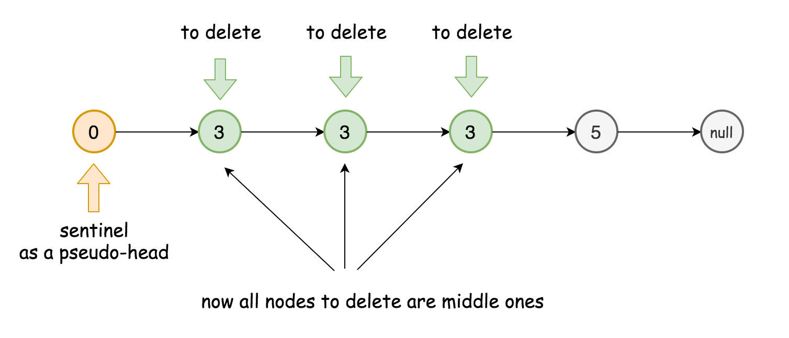

# Solving Technique

### Two-Pointer Technique

**Scenarios:**

1. Iterate the array from two ends to the middle;

   This technique is often used in a **sorted** array.

2. One slow-runner and one fast-runner at the same time.

   Sometimes might need to **sort** the array before using the two-pointer technique. And probably need a **greedy** thought to determine movement strategy for both pointers.

At the time using slow-fast pointers, we need to always consider the **difference** between the pointers. 

**Template for two-pointer problem in the linked list**

```python
# Definition for singly-linked list.
# class ListNode:
#     def __init__(self, x):
#         self.val = x
#         self.next = None

# Initialize slow & fast pointers
slow = head
fast = head
# Change this condition to fit specific problem.
# Attention: remember to avoid null-pointer error
while slow and fast and fast.next:
    slow = slow.next # move slow pointer one step each time
    fast = fast.next.next # move fast pointer two steps each time
    if slow is fast: # change this condition to fit specific problem
        return True
return False # change return value to fit specific problem
```

Remember:

1. Always examine if the node is null before you call the next field;
2. Carefully define the end conditions of your loop.

**Sentinel Node**

Sentinel nodes are widely used in trees and linked lists as pseudo-heads, pseudo-tails, markers of level end, etc. They are **purely functional**, and usually does not hold any data. Their main purpose is to standardize the situation, for example, make linked list to be never empty and never headless and hence simplify insert and delete.

Two standard examples:

* **LRU Cache**, sentinel nodes are used as pseudo-head and pseudo-tail.

* **Tree Level Order Traversal**, sentinel nodes are used to mark level end.



**A Comparison of Time Complexity**


